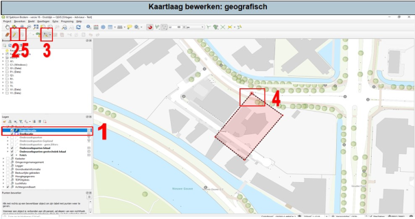

1.	Selecteer de kaartlaag die je wilt bewerken. 
2.	Zet bewerken van de kaartlaag aan. 
3.	Selecteer de optie voor het bewerken van de datalaag (i.p.v. een nieuwe toevoegen). 
4.	Klik op het punt van het vlak dat je wilt wijzigen en verplaats deze naar de nieuwe locatie. Voor punten werkt dit hetzelfde. 
5.	Als je klaar bent met het wijzigen, klik dan op ‘bewerkingen opslaan’. 
6.	Nadat je klaar bent met het bewerken, zet het bewerken uit (2).

Let op. Niet alle datalagen kan je bewerken (zie ook hoofdstuk 3 van de uitgebreide handleiding).

