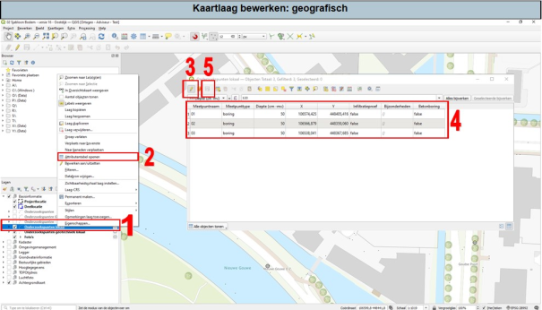

1.	Klik met je rechtermuisknop op de kaartlaag. Er opent een menu.
2.	Selecteer ‘Attributentabel openen’. Er open nu een tabel waarin alle attributen van de datalaag in staan.
3.	Zet bewerken aan.
4.	Je kan nu op een cel klikken waarvan je de waarde wilt aanpassen.
5.	Nadat je je aanpassingen hebt gedaan, klik op opslaan.
6.	Als je klaar bent met bewerken, zet je het bewerken uit (3).
7.	De attributen tabel kan nu worden afgesloten.

Meer informatie over de attributentabel is te vinden in hoofdstuk 3.3 van de uitgebreide handleiding.

