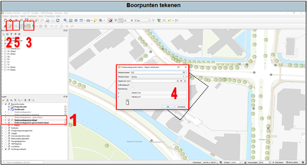

1.	Selecteer de kaartlaag (onderzoekspunten lokaal of geotechniek lokaal). 
2.	Zet bewerken van de kaartlaag aan in de taakbalk (het potloodje). 
3.	Klik vervolgens op knopje 3 om aan te geven dat je een nieuw object wilt tekenen. Klik op de locatie op de kaart waar het onderzoekspunt geplaatst moet worden. 
4.	Van ieder onderzoekspunt moet je aangeven wat de eigenschappen zijn (naam, type, diepte, etc.) en klik dan op ‘ok’. 

	a. Mocht een van de punten na het opslaan toch foutief zijn (bijvoorbeeld het is een ondiepe boring terwijl het een diepe boring had moeten zijn), dan kan je dit achteraf nog aanpassen. Zie [8. Kaartlaag bewerken: karakteristieken](/introduction/BewerkenKarakteristieken) hiervoor.

	b. Mocht je een van de punten toch nog willen verplaatsen, blader dan naar [7. Kaartlaag bewerken: geografisch](/introduction/BewerkenGeografisch).

5.	Als je klaar bent met bewerken, dan kan je het bewerken van de kaartlaag uitzetten (2).
6.	Sla vervolgens de kaartlaag op (zie [6. Datalaag opslaan](/introduction/DatalaagOpslaan)). De kaartlaag wordt opgeslagen onder het mapje ‘Shape’ in de ‘GIS’-map van het project en krijgt de naam ‘onderzoekspunten’.

Meer informatie en handigheden met betrekking tot het tekenen staan in hoofdstuk 3, 10 en 11 van de uitgebreide handleiding.
