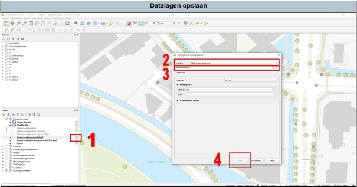

1.	Klik op het symbooltje achter de kaartlaagnaam. Er opent nu een pop-up menu. 
2.	Bij indeling, selecteer ‘ESRI-shape gegevens’. 
3.	Kies de bestandslocatie: map ‘GIS’ en dan de submap ‘shape’. Geef het bestand een naam. 
4.	Klik op ‘OK’. De punten zijn nu opgeslagen als een ‘shapefile’.

Meer informatie over permanente en tijdelijke tekenlagen is te vinden in hoofdstuk 3.2 van de uitgebreide handleiding.

