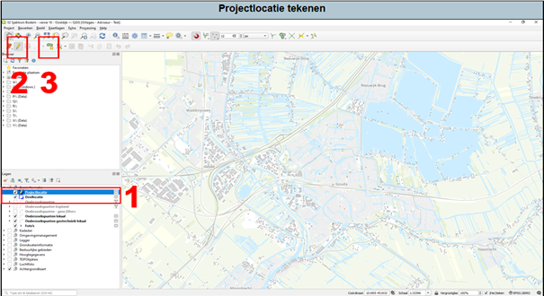

1. Als eerst selecteer je de kaartlaag ‘Projectlocatie’. 
2. Zet bewerken van de kaartlaag aan in de taakbalk (het potloodje). 
3. Geef aan dat je een nieuw gebied wil tekenen. 

	a.	 Het tekenen doe je door met je muis op de kaart te klikken. Met een klik op de rechtermuisknop laat je QGIS weten dat je weten dat je klaar bent met het tekenen.

	b.	Als je klaar bent met het bewerken, dan kan je het bewerken van de kaartlaag uitzetten door nog een keer op het potloodje te klikken (2).

	c.	Sla de kaartlaag vervolgens op (Zie [7. Kaartlaag bewerken: geografisch](/introduction/Kaartlaagbewerkengeografisch)). De onderzoekslocatie slaan wij op onder het mapje ‘Shape’ in het ‘GIS’-mapje en krijgt de naam ‘onderzoekslocatie’ of ‘projectlocatie’.

Voor meer informatie over permanente en tijdelijke tekenlagen en vectorlagen zie hoofdstuk 2 en 3 in de uitgebreide handleiding.

Voor het georefereren van de projectlocatie vanuit een afbeelding of PDF, zie hoofdstuk 5 van de uitgebreide handleiding.

