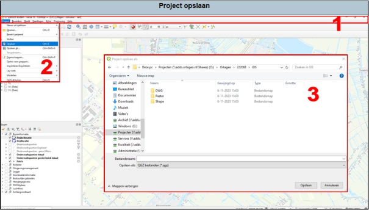

Als je een nieuw QGIS project hebt aangemaakt, dan kan je deze op de volgende manier opslaan.

1.	In de taakbalk klik op ‘project’, dan opent er een uitklapvenster. 
2.	Klik vervolgens op  ‘opslaan’ in het uitklapvenster. 
3.	Er wordt een pop-up scherm geopend waar je kan kiezen waar je je jouw bestand opslaat. Binnen Ortageo hebben we de afspraak dat je het QGIS bestand onder jouw project opslaat in het mapje ‘GIS’. Bij bestandsnaam voer je het projectnummer in. Klik vervolgens op het knopje ‘opslaan’.
