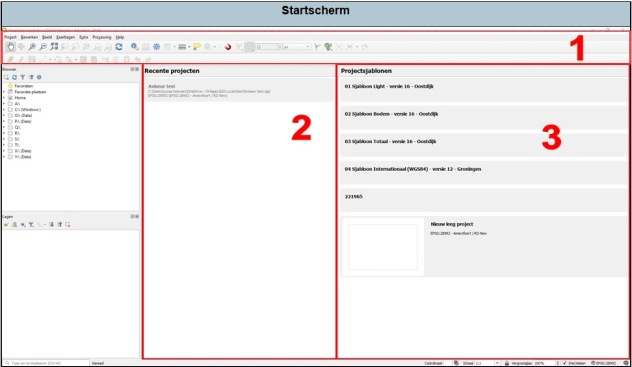

Bij het opstarten van QGIS krijg je het volgende scherm te zien. Hier kan je of een al opgeslagen project openen (2) of een nieuw project openen (3).

1.	Taakbalk: hier zijn alle extra functies te vinden.
2.	Recente projecten: Als je dubbel klikt op een project, dan wordt deze geopend.
3.	Ortageo sjablonen: Als je dubbel klikt op een sjabloon, dan wordt deze geopend.

