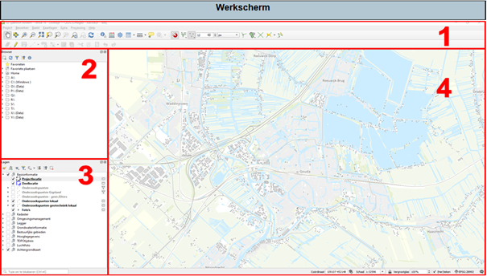

Als je een QGIS project hebt geopend, dan krijg je het volgende scherm te zien.

1.	Hier zitten alle extra opties, zoals kaartlagen toevoegen en attributen bewerken. 
2.	Hier kan je de koppelingen naar kaartlagen zien die in het QGIS project bekend zijn. Je hebt hier de mogelijkheid om extra kaartlagen toe te voegen die niet in het sjabloon zitten.
3.	Hier kan je de lijst zien met alle kaartlagen die zijn ingeladen in het QGIS project. Door op de box te klikken voor de kaartlaag, kan je de kaartlaag zichtbaar maken of juist onzichtbaar. Als het vinkje in de box staat, staat de kaartlaag aan en als de box leeg is, dan staat de kaartlaag uit.
4.	Weergave van alle actieve kaartlagen

Voor uitgebreidere informatie over het werkscherm en het opstarten van een Qgis project, zie hoofdstuk 1 in de uitbreidere handleiding.
