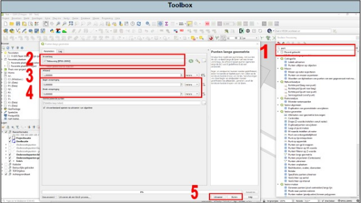

---

title: "10.1 Punten langs geometrie"

date: 2025-11-18

draft: false

weight: 10

---

Bij langere tracés kan deze functie erg handig zijn. Hiermee kan je het aantal boringen op een vooraf bepaalde afstand van elkaar laten berekenen (zie Figuur 10.1).

1. Zoek in de toolbox ‘punten langs geometrie’ op en dubbelklik hierop. Er verschijnt een pop-upscherm.
2. Kies de invoer laag. Kies je laag van het tracé/onderzoekslocatie.
3. Bepaal de afstand tussen de boorpunten (lengte tracé delen door het aantal boorpunten);
4. Bepaal of en hoeveel afstand er moet zijn tussen het begin/einde van de lijn en het eerste boorpunt;
5. Druk op uitvoeren en vervolgens sluiten.

Er is nu een tijdelijke tekenlaag aangemaakt met (als het goed is) het juiste aantal boorlocaties op de ingestelde afstand van elkaar. Om te controleren of het aantal boorpunten klopt, open de attributentabel en controleer het aantal regels. Indien dit niet klopt, dan zal je de afstand tussen de boorpunten moeten aanpassen.

Figuur 10.1

Je hebt nu een bepaald aantal punten langs je onderzoekstracé staan zonder boordiepte, coördinaten en nummer. Dit kan je op 2 manieren oplossen:

1. De laag ‘onderzoekspunten lokaal’ bewerken en middels snappen (zie 11.4 Snappen) de boorpunten op de juiste locaties zetten en de betreffende dieptes invoeren.

2\. Middels veldberekeningen in de attributentabel de waardes bepalen (zie 3.3.4 Geometrie berekenen).

Zelf zal je moeten nagaan wat voor jou het makkelijkste werkt.

