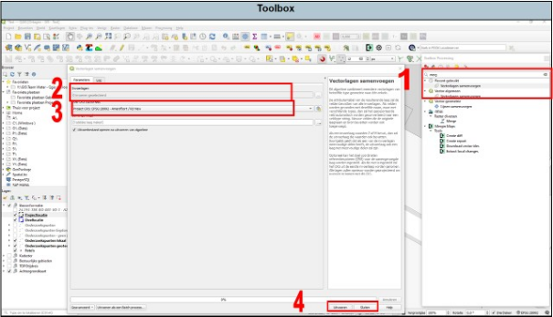

---

title: "10.2 Merge"

date: 2025-11-18

draft: false

weight: 20

---

Het kan voorkomen dat je twee of meer vectorlagen samen wil voegen. Dit kan middels het tooltje ‘merge’ of ‘vectorlagen samenvoegen’ (zie Figuur 10.2).

1. Zoek in de toolbox op ‘merge’ of ‘samenvoegen’ en dubbelklik op ‘vectorlagen samenvoegen’.
2. Selecteer de lagen die je wilt samenvoegen;
3. Selecteer het juiste CRS (Amersfoort/RD NEW).
4. Druk op uitvoeren en vervolgens sluiten. 

Figuur 10.2

Er is nu een tijdelijke tekenlaag aangemaakt. Controleer of het samenvoegen goed is gegaan en maak de tekenlaag permanent.

