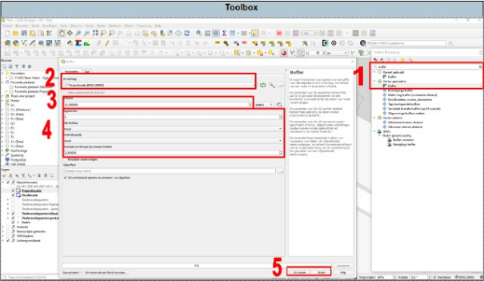

---

title: "10.3 Buffer"

date: 2025-11-18

draft: false

weight: 30

---

Het is mogelijk om een buffer rondom je onderzoekslocatie of tekenlaag te maken (zie Figuur 10.3).

1. Zoek naar buffer en dubbelklik op ‘buffer’. Er wordt een pop-upscherm geopend.
2. Selecteer de laag waarvan een buffer gemaakt moet worden.
3. Bepaal de afstand van de buffer.
4. Hier kan je bepalen hoe je buffer eruit komt te zien (hoekig of minder hoekig).
5. Druk op uitvoeren en vervolgens sluiten.

Figuur 10.3

Er is nu een tijdelijke tekenlaag aangemaakt. Controleer of het samenvoegen goed is gegaan en maak de tekenlaag permanent.

