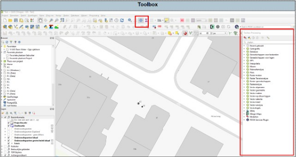

In Qgis kan je allerlei berekeningen, analyses en andere functies uitvoeren. De meeste van deze dingen zijn terug te vinden in de toolbox (zie Figuur 10).

 

Figuur 10

Het grootste deel van deze functies gebruiken wij niet tot nauwelijks binnen bodemonderzoek. De volgende functies kunnen mogelijk wel handig zijn.

&nbsp;

[10.1 Punten langs geometrie](10.1Puntenlangsgeometrie/)

[10.2 Marge](10.2Merge/)

[10.3 Buffer](10.3Buffer/)