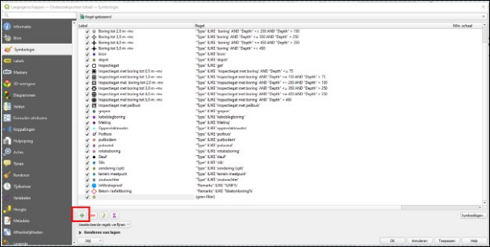
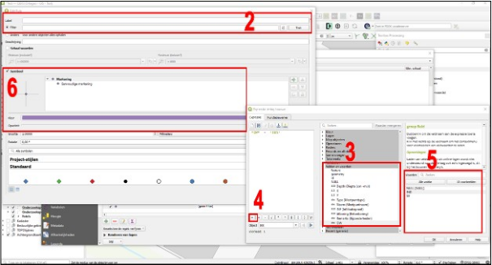
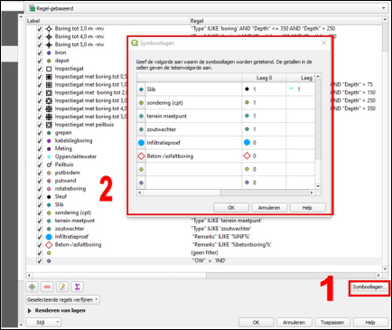

---

title: "11.1 Verontreinigingssituatie weergeven"

date: 2025-11-18

draft: false

weight: 10

---

Het is mogelijk om per boring te verontreinigingssituatie weer te geven. Dit moet op dit moment echter nog wel handmatig worden gedaan. Mogelijk wordt dit in een later stadium via Terra Index geregeld wordt.

Als eerst zal je in de attributentabel per boorpunten zelf de verontreinigingssituatie moeten aangeven. Maak hiervoor een nieuw veld aan (zie Figuur 11.1a). Sla de wijziging op en ga nu naar laageigenschappen. Voeg bij de symbologie een nieuw symbool toe.

Figuur 11.1a

* Geef het nieuwe symbool een naam (bijvoorbeeld ‘Sterk verontreinigd’) en ga nu naar filter en druk op ‘expressie’ (2 in Figuur 11.1b).
* 
* Ga naar het kopje ‘velden en waarden’ en dubbelklik op de naam van de kolom die je in de attributentabel hebt toegevoegd (3).
* 
* Druk nu op het ‘=’ tekentje (4). Druk vervolgens op ‘alle unieke’ bij de waarden en dubbelklik de betreffende waarde (5). Druk op ‘OK’. Met deze expressie (in het voorbeeld “OW” = “IND”) geef je aan dat alle boorlocaties welke klasse industrie zijn, een bepaald symbool krijgen.
* Bepaal de karakteristieken van het symbool (6) en druk op ‘OK’.

Figuur 11.1b

Vervolgens ga je instellen dat het extra symbool achter het symbool van de boringtype staat. Hiermee kan je gewoon de diepte van de boring weergeven, maar dan wel met de verontreinigingssituatie. Normaliter hoef je hier weinig voor te doen behalve het controleren. Druk op symboollagen (1 in Figuur 11.1c) en controleer of je aangemaakte symbolen in ‘laag 0’ staan met de waarde ‘0’.  Als je in dit scherm kijkt, dan zie je dat de symbolen voor de boringen de waarde ‘1’ hebben. Hierdoor komen deze voor het extra symbool (verontreinigingssituatie) te staan. Druk 2x op ‘OK’.

Figuur 11.1c

Doe dit vervolgens opnieuw voor elke waarde die je hebt.

