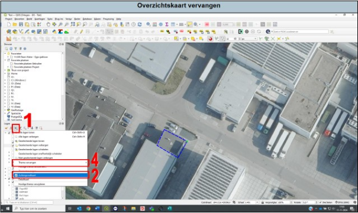

---

title: "11.2 Overzichtskaart aanpassen"

date: 2025-11-18

draft: false

weight: 20

---

Bij een lang tracé kan het mooi maar ook handig zijn om in het overzichtskaartje van het boorplan/situatietekening het gehele tracé weer te geven. Dit kan je als volgt doen (Figuur 11.2):

1. Klap dit menuutje uit.
2. Selecteer achtergrond kaart. Er verdwijnen nu een aantal lagen, dit komt omdat alleen de lagen zichtbaar worden welke zichtbaar zijn in de overzichtskaart.
3. Selecteer de lagen welke je zichtbaar wilt maken in de overzichtskaart.
4. Druk op ‘thema vervangen’ en selecteer ‘achtergrond kaart’. Refresh de print-layout, je aangepaste overzichtskaart wordt nu zichtbaar.

Figuur 11.2

