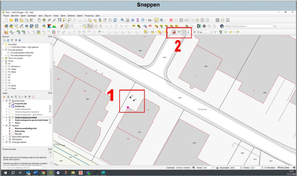

---

title: "11.3 Snappen"

date: 2025-11-18

draft: false

weight: 30

---

Als je nieuw te plaatsen punten op punten in de kadastrale laag wilt plakken of met de Georeferencer punten van je tekening op de kadastrale lagen wilt plakken, dan is het aan te raden om ‘snappen’ in te schakelen. 

In onderstaande figuur (Figuur 11.3) wil ik boorpunt 02 verplaatsen naar het hoekpunt van het pand (1). Het roze vierkantje geeft aan dat snappen is ingeschakeld en dat boorpunt 02 exact op de hoek geplaatst wordt.

Snappen schakel je in door het magneetje (2) in te schakelen.

Figuur 11.3

