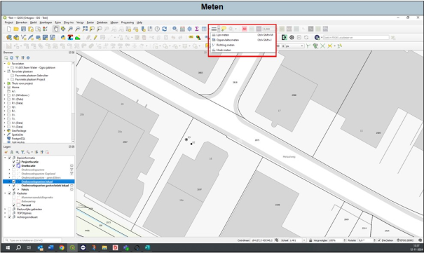

---

title: "11.4 Meten"

date: 2025-11-18

draft: false

weight: 40

---

Om even snel een afstand of oppervlakte te meten hoef je niet persé via de attributentabel de veldberekening te openen. Je kan dit snel via het volgende knopje doen (Figuur 11.4).

Figuur 11.4

