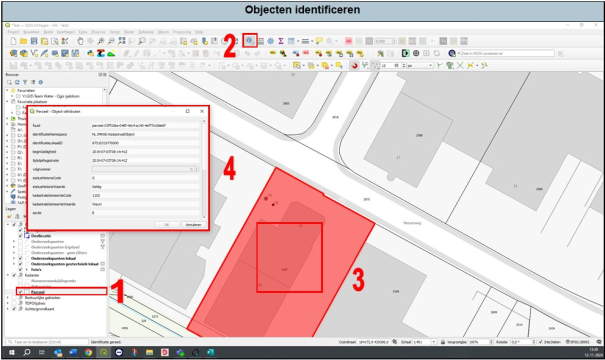

---

title: "11.5 Objecten identificeren"

date: 2025-11-18

draft: false

weight: 50

---

Om bijvoorbeeld gegevens van kadastrale percelen of de hoogte van een specifiek punt op de AHN, kan je gebruik maken van ‘objecten identificeren’ (zie Figuur 11.5).

1. Selecteer de datalaag waarvan je bepaalde informatie nodig hebt.
2. Druk op ‘objecten identificeren’.
3. Klik op het punt waar je iets van wilt weten.
4. Er verschijnt nu een pop-upscherm met informatie van het geselecteerde punt uit de geselecteerde datalaag.

Figuur 11.5

