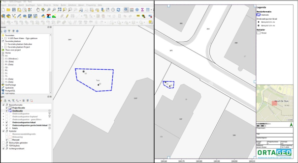
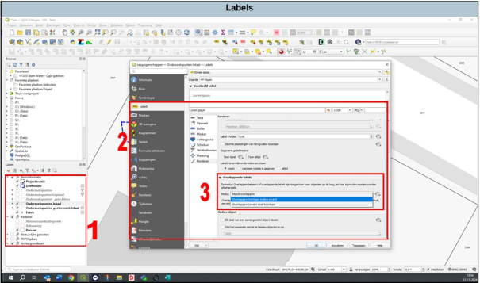

---

title: "11.6 Overlappende labels"

date: 2025-11-18

draft: false

weight: 60

---

Het kan voorkomen dat bij labels niet zichtbaar worden in de print lay-out omdat deze te dicht bij elkaar staan (zie Figuur 11.6a).

Figuur 11.6a

Dit is eenvoudig op te lossen (Figuur 11.6b).

1. Ga naar de eigenschappen van de betreffende laag waarbij het label niet zichtbaar is.
2. Ga naar labels en scroll naar het kopje ‘overlappende labels’.
3. Selecteer ‘overlappen zonder straf toestaan’. Druk vervolgens op ‘OK’. De labels zijn als het goed is nu wel zichtbaar in de lay-out.

Figuur 11.6b

