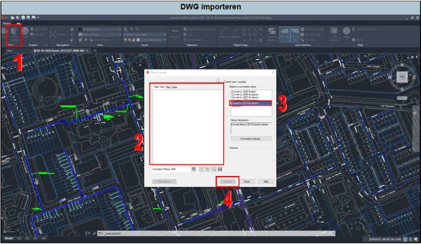

---

title: "11.7 DWG importeren"

date: 2025-11-18

draft: false

weight: 70

---

Vaak worden door opdrachtgevers DWG-bestanden aangeleverd. Deze kan je in principe gewoon in Qgis laden. Hierbij ben je echter wel afhankelijk van of de lijnen in het DWG-bestand aan coördinaten gekoppeld zijn, hier kom je echter pas achter als je de DWG in Qgis hebt geladen.

1. Open de DWG in de DWG-viewer (DWG Trueview; zie Figuur 11.7). Mogelijk krijg je nog wat meldingen, deze kan je meestal negeren (ignore). Druk nu op ‘DWG-convert’.
2. Op de DWG in het pop-upscherm.
3. Selecteer ‘convert to 2013 (in-place)’.
4. Druk nu op convert.

Figuur 11.7

**Tip:** werk vanaf de C-schijf bij het importeren van een DWG. Dit scheelt heel erg veel tijd.

Ga nu weer terug naar Qgis.

1. Ga naar project en dan importeren/exporteren.
2. Druk vervolgens op ‘lagen importeren vanuit DWG/DXF’. Er verschijnt een pop-upscherm.
3. Maak een doelpakket aan. Maak deze aan in de submap ‘DWG’ in de GIS-map.
4. Controleer of de CRS nog klopt en selecteer de tekening vanuit de map waarin deze staat opgeslagen.

De DWG wordt nu geïmporteerd. Dit kan even duren (afhankelijke van de grootte). Indien je werkt vanaf de O-schijf, dan kan het flink lang duren.

5\. Geef de groep waarin de lagen staan een naam en druk op ‘OK’. De DWG is nu geïmporteerd.

&nbsp;

Het kan zijn dat de DWG-lagen beneden de achtergrondkaart staat. Hierdoor word je DWG niet zichtbaar. Schuif de achtergrondkaart onder de DWG-laag.

Indien deze nog steeds niet zichtbaar is, druk rechtermuisknop op de DWG-laag en druk op ‘zoom naar groep’ of ‘zoom naar laag’. Als de gegevens uit het DWG-bestand niet ter plaatse van de exacte locatie van de onderzoekslocatie zijn gelegen, dan is aan het DWG-bestand geen coördinaten gekoppeld. Dit kan je oplossen door een PDF te maken in de DWG-viewer of een nieuw bestand op te vragen bij je opdrachtgever.

