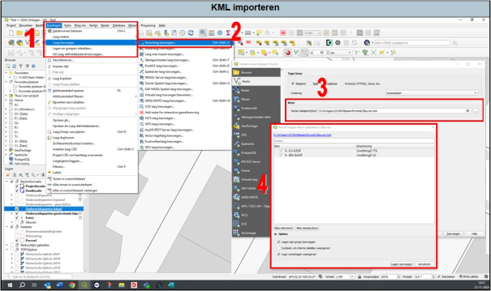

---

title: "11.8 KML-bestand importeren"

date: 2025-11-18

draft: false

weight: 80

---

Naast DWG, shapefile en Pdf-bestanden worden soms door opdrachtgevers KML-bestanden aangeleverd. KML-bestanden worden in Google Earth geopend als je dubbelklikt op zo’n bestand.

Het importeren van een KML-bestand werkt hetzelfde als het importeren van een shapefile (zie Figuur 11.8).

1. Ga naar kaartlagen en vervolgens ‘laag toevoegen’.
2. Druk op ‘vectorlaag toevoegen’. Er verschijnt een pop-upscherm.
3. Selecteer het bestand en druk op toevoegen.
4. Mogelijk verschijnt er nog een pop-upscherm, druk hier op ‘lagen toevoegen’.

Figuur 11.8

