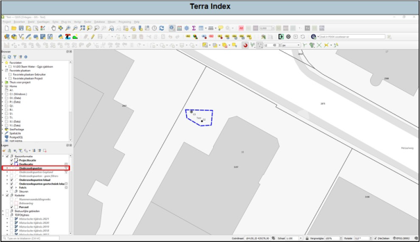
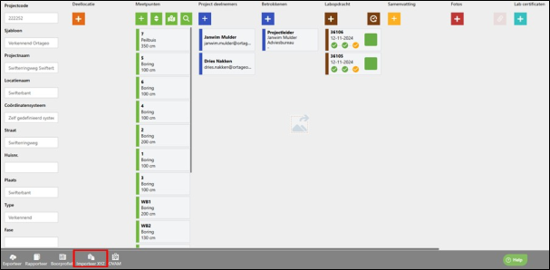
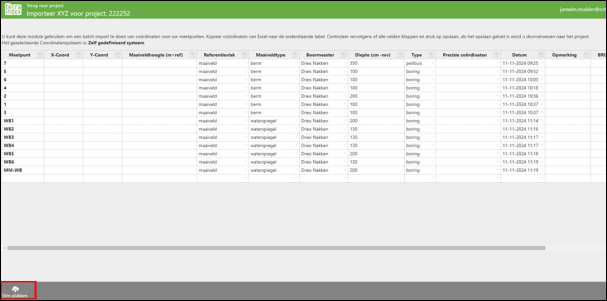
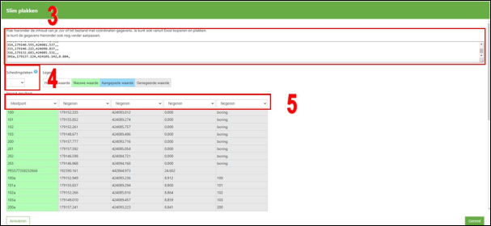

---

title: "11.9 Terra Index in Qgis"

date: 2025-11-18

draft: false

weight: 80

---

Terra Index is gekoppeld met Qgis. Indien de boorpunten in Terra Index zijn voorzien met X- en Y-coördinaten dan kan je deze zichtbaar maken met de laag ‘onderzoekspunten’ (zie Figuur 11.9a). Alle boorpunten met X- en Y-coördinaten worden nu zichtbaar.

Figuur 11.9a

Indien veldwerk is uitgevoerd en je hebt van de boorpunten coördinaten, dan is het aan te raden om deze in Terra Index up te loaden. Dan hoef je alleen de laag ‘onderzoekspunten’ aan te vinken en de boorpunten staan op de juiste plek met het juiste symbool op basis van de diepte.

Het importeren van coördinaten in Terra Index doe je als volgt (Figuur 11.9b).

1. Ga naar het betreffende project in Terra Index en druk op ‘importeer XYZ’.

Figuur 11.9b

2\. Druk op Slim plakken.

Figuur 11.9c

3\. Plak de coördinaten in het vak.

4\. Selecteer het juiste scheidingsteken.

5\. Selecteer welke kolom wat is. Hier is alleen het meetpunt en de X en Y (soms ook Z) interessant.

6\. Druk op Gereed en vervolgens op opslaan.

Figuur 11.9d

