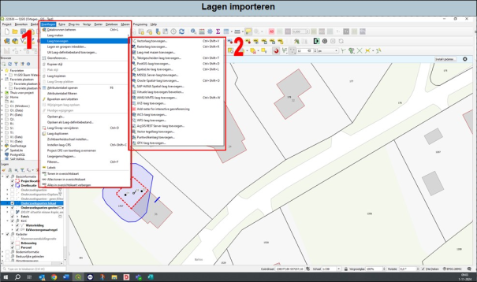
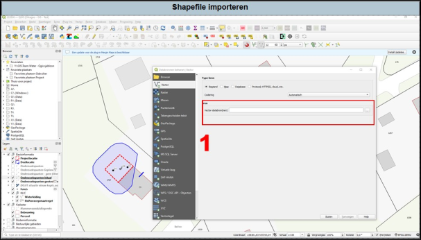
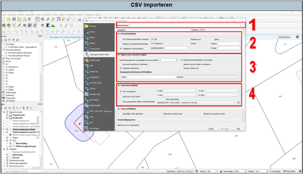

---

title: "2.4.1 Meetpunten importeren"

date: 2025-11-10

draft: false      

---

Afhankelijk van het aangeleverde bestand, kan je aangeleverde meetpunten importeren. Indien dit mogelijk is of het bestand voldoet niet, dan kan je het beste contact opnemen met de tekenkamer. Mogelijk kunnen zij het omzetten, anders zou je ook contact met de opdrachtgever kunnen opnemen.

  
  Figuur 2.4.1a

1. Als je een shapefile wilt importeren, ga in de werkbalk naar ‘kaartlagen’ en vervolgens naar ‘laag toevoegen’ (1 in Figuur 2.4.1a).
2. Er opent nu een nieuw pop-upscherm. Indien je een Shapefile wilt importeren, druk op ‘Vectorlaag toevoegen’. Het volgende pop-upscherm wordt zichtbaar (Figuur 2.4.1b).

  
  Figuur 2.4.1b

1. Druk op de knop met de drie puntjes en zoek het desbetreffende shapefile (SHP) op. Druk op ‘openen’ in de verkenner en vervolgens op ‘toevoegen’ in het pop-upscherm uit Figuur 2.4.1b.

Als je een CSV wilt importeren, druk op ‘tekstgescheiden laag toevoegen’ uit Figuur 2.4.1a. Het volgende pop-upscherm wordt zichtbaar (Figuur 2.4.1c).

  
  Figuur 2.4.1c

1. Selecteer het juiste bestand.
2. Afhankelijk van het bestand, is de informatie gescheiden met komma’s, puntkomma’s, dubbele punt etc. Selecteer de juiste tekstscheiders.
3. Mogelijk bestaat de eerste regel van de CSV kolomnamen of niet. Dit geef je in dit vak aan.
4. Selecteer welk veld de X en Y waardes zijn. Als de tekstscheiders in punt 2 niet goed zijn gekozen, dan komen hier geen of verkeerde waardes te staan.
5. Druk op toevoegen.

**Let op!** Als je een CSV hebt toegevoegd aan Qgis, dan kan je binnen Qgis de eigenschappen en waardes van de CSV niet aanpassen. Hiervoor zal je of de CSV buiten Qgis moeten aanpassen.

