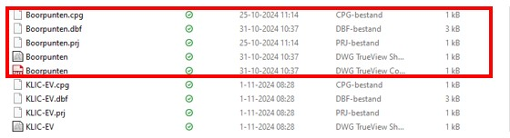

---

title: "2.4.2 Meetpunten exporteren"

date: 2025-11-10

draft: false

---

Je kan de meetpunten die je in QGIS hebt getekend omzetten naar een CSV bestand. Dit kan je bijvoorbeeld gebruiken om vrijstelling te vragen voor een EV of om de punten te versturen naar de GPS.

1. Klik met je rechtermuisknop op de kaartlaag (1 in Figuur 14). Er opent een menu.
2. Klik op ‘exporteren’ en vervolgens op ‘objecten opslaan als’. Er opent een nieuw pop-up menu.
3. Bij indeling, selecteer ‘Komma gescheiden waarden \[CSV].
4. Kies de bestandslocatie en geef het bestand een naam.
5. Klik op ‘OK’. De punten zijn nu opgeslagen in een CSV-bestand.

**Tip:** zet bij kopje 6 in Figuur 14 ‘type geometrie’ op ‘punt’ en vink het vakje ‘multi-type forceren’ aan. Hiermee is de kans dat je het CSV-bestand zonder problemen in de Marxact krijgt, een stuk groter.

Indien vanuit een opdrachtgever of een leidingbeheerder gevraagd wordt om een shapefile-bestand van de boorpunten, dan staat de shapefile in de projectmap, in de submap ‘GIS’ in het mapje ‘Shape’. Let hierbij op dat je alle 5 de bestanden van de shapefile meestuurt / upload (zie Figuur 15). Het makkelijkste is om deze 5 bestanden te zippen.

