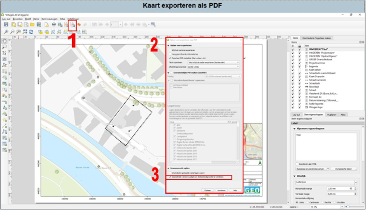

---

title: "2.5 Tekening exporteren als PDF"

date: 2025-11-10

draft: false

---

Het exporteren als PDF is handig als je een boorplan of een situatietekening maakt.

1. Klik in de taakbalk op het bovenstaande icoontje (1 in Figuur 16). Er opent nu een scherm waarin je de bestandslocatie en -naam moet opgeven.
2. Nadat je de bestandslocatie en -naam hebt opgegeven opent dit scherm zich.
3. Helemaal onderaan staat de optie ‘geometrieën vereenvoudigen om bestandsgrootte te verkleinen’, zet dit vinkje altijd uit.
4. Klik nu op de knop ‘opslaan’. Je PDF wordt nu opgeslagen.\\

