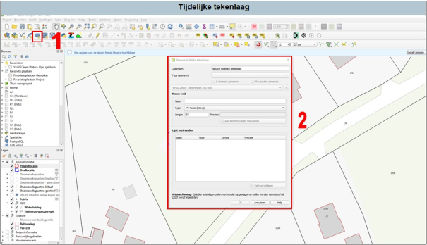

---

title: "3.2.1 Tijdelijke tekenlaag"

date: 2025-11-10

draft: false    

---

Tijdelijke lagen zijn handig als je snel iets wilt tekenen of schetsen zonder meteen een bestand op te slaan. Dit is ideaal voor tijdelijke analyses of wanneer je snel iets wilt testen. Om een tijdelijke tekenlaag te maken, ga je naar de menubalk en klik je op " "Nieuwe tijdelijke tekenlaag..." (zie 1 in Figuur 18). Hier kies je het gewenste geometrie-type, zoals een punt, lijn of polygoon, en selecteer je het coördinatenreferentiesysteem (CRS) dat je wilt gebruiken (zie 2 in Figuur 18). Binnen Ortageo maken wij altijd gebruik van het CRS van Amersfoort (EPSG:28992; zie ook 3.6 Coördinaten systemen van kaartlagen (CRS)). De tijdelijke laag verschijnt nu in het lagenpaneel, waarna je kunt beginnen met het tekenen van objecten. Het is belangrijk om te onthouden dat, aangezien het een tijdelijke laag is, deze niet automatisch wordt opgeslagen. **Als je QGIS sluit zonder de laag op te slaan, verlies je de gegevens.** Als je klaar bent met je tijdelijke laag en deze wilt opslaan, kun je rechtsklikken op de laag in het lagenpaneel, kiezen voor "Exporteren" en vervolgens "Objecten opslaan als...". Hiermee kun je de laag opslaan.

