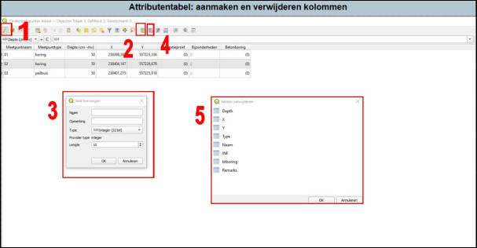

---

title: "3.3.2 Aanmaken en verwijderen kolommen"

date: 2025-11-10

draft: false    

---

Indien nodig kan je kolommen aanmaken of verwijderen uit de attributentabel:

1. Zodra je de attributentabel hebt geopend, druk op het icoontje voor het bewerken (1 in Figuur 21).
2. Voor het aanmaken van een nieuwe kolom druk op Nieuw Veld.
3. Er verschijnt een pop-upscherm. Vul hier de naam van de kolom in; het type gegeven (is het tekst dat je wilt invullen of een decimaal getal) en de lengte van de hoeveelheid tekens dat je benodigd denkt te hebben1. Druk vervolgens op ‘OK’ en je kolom komt tevoorschijn.
4. Voor het verwijderen van een kolom, druk op Veld Verwijderen.
5. Er verschijnt een pop-upscherm. Selecteer de kolom die je wilt verwijderen en druk op ‘OK’. De kolom wordt verwijderd.

1**Let op!** Als je een kolom aanmaakt voor coördinaten, kies bij type dan decimaal getal (Decimaal getal (real)). Anders worden je coördinaten zeer onnauwkeurig (geen getallen achter de komma).

