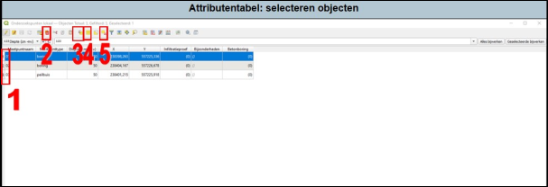

---

title: "3.3.3 Selecteren van objecten"

date: 2025-11-10

draft: false    

---

Als je specifieke rijen (attributen) wilt bewerken, zichtbaar maken of verwijderen, dan kan je deze selecteren.

1. Je kan door op het rijnummer te klikken de desbetreffende rij(en) selecteren (1 in Figuur 3.3.3).
2. Als je een rij of meerdere rijen hebt geselecteerd, dan kan je door op thet prullenbak icoontje te klikken deze verwijderen.
3. Je kan ook middels een ‘expressie’ rijen selecteren. Bijvoorbeeld alle boringen van 0,5 m-mv. Dan zijn alle boringen met deze diepte geselecteerd.
4. Hier kan je alle rijen (attributen) selecteren.
5. Als je een rij niet meer geselecteerd wil hebben, druk dan op dit icoontje.

  
  Figuur 3.3.3

