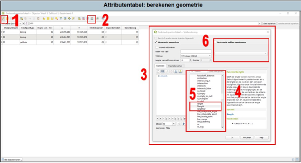

---

title: "3.3.4	Geometrie berekenen"

date: 2025-11-10

draft: false    

---

Indien je een nieuwe Shapefile hebt aangemaakt voor bijvoorbeeld een tracé, dan kan je middels de attributentabel de lengte berekenen. Dit doe je als volgt (zie Figuur 3.3.4):

<ol style="margin-left: 1em;">

<li>Open de attributentabel en druk op het icoontje voor bewerken (hoeft niet).</li>

<li>Druk op het icoontje van de ‘veldberekening’.</li> 

<li>Er opent een nieuw pop-upscherm.</li>

<li>Zoek naar het kopje ‘Geometrie’ en klap deze uit. Er wordt nu een waslijst aan mogelijkheden zichtbaar. Voor bodemonderzoek zijn de volgende vaak relevant:</li>

<ol style="margin-left: 2em; list-style-type: lower-alpha;">

<li>Area: hiermee bereken je de oppervlakte van bijvoorbeeld een locatie1.</li>

<li>Length: hiermee bereken je de lengte van bijvoorbeeld een tracé.</li>

<li>X: hiermee bereken je de x-coördinaat</li>

<li>Y: hiermee bereken je de y-coördinaat.</li>

</ol>

<li>Als je één van de bovenstaande wilt berekenen, druk dan op $area, $length, $x of $y!</li>

<li>Nu verschijnt er een nieuwe kolom in je attributentabel met het resultaat van de berekening. Vergeet niet om de bewerking op te slaan!</li>

</ol>

  
  Figuur 3.3.4

1Indien het oppervlak verandert van de locatie, dan kan je dit opnieuw berekenen. Open opnieuw de ‘veldberekening’ en vink nu ‘bestaande velden vernieuwen’ aan (6 in Figuur 3.3.4). Selecteer de betreffende kolom en druk vervolgens op ‘OK’.

