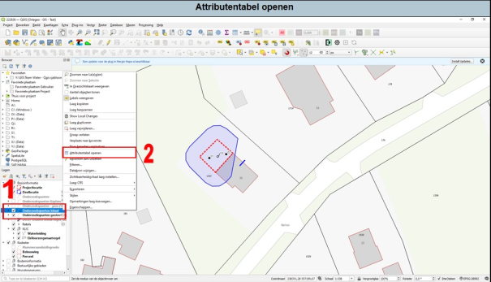

Vectorlagen kan je voorzien van informatie per attribuut (boorpunt bijvoorbeeld). Zo kan je een onderzoekspunt intekenen en aangeven of dit een boring, peilbuis of CPT is.

De attributentabel is een centrale plaats in QGIS waar alle informatie die je aan de onderzoekspunten hebt gekoppeld, wordt opgeslagen. Je kunt deze tabel openen en gebruiken om de attributen te beheren en te analyseren.

Hoe open je de attributentabel:

Nadat je de onderzoekspunten hebt ingetekend in je vectorlaag, kun je de attributentabel openen door naar het lagenpaneel te gaan (zie Figuur 19).

1. Rechtsklik op de laag die je hebt gemaakt voor de bodemonderzoekspunten.
2. Kies in het contextmenu dat verschijnt voor "Attributentabel openen".

De attributentabel wordt nu geopend (zie ook Figuur 20), waarbij elke rij een specifiek onderzoekspunt vertegenwoordigt. Elke kolom komt overeen met een attribuut zoals "Type", "Diepte", enzovoort.

