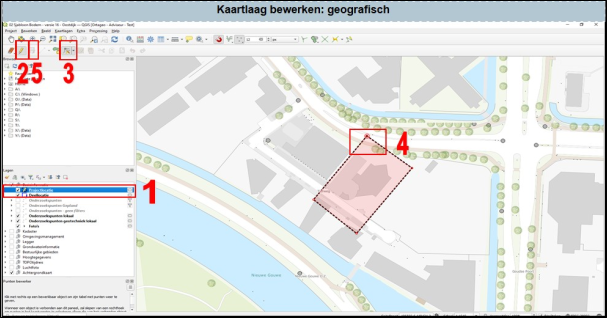

---

title: "3.4.1	Aanpassen van de geometrie van een vectorlaag (polygoon of lijn)"

date: 2025-11-11

draft: false      

---

Als je de vorm van een polygoon of lijn, bijvoorbeeld van je onderzoekslocatie, wilt aanpassen, dan kan dat als volgt:

1. Selecteer de kaartlaag die je wilt bewerken (1 in Figuur 3.4.1). 
2. Zet bewerken van de kaartlaag aan. 
3. Selecteer de optie voor het bewerken van de datalaag (i.p.v. een nieuwe toevoegen). 
4. Klik op het punt van het vlak dat je wilt wijzigen en verplaats deze naar de nieuwe locatie. Voor punten werkt dit hetzelfde.
5. Als je klaar bent met het wijzigen, klik dan op ‘bewerkingen opslaan’. 
6. Nadat je klaar bent met het bewerken, zet het bewerken uit (2).

  
  Figuur 3.4.1

