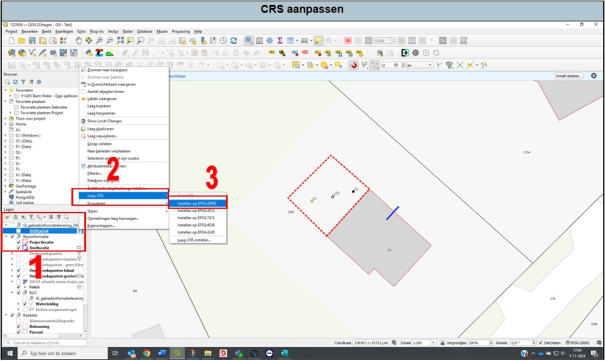

---

title: "3.6 Coördinaten systemen van kaartlagen (CRS)"

date: 2025-11-11

draft: false 

weight: 60     

---

In principe zijn alle kaartlagen van Nederlandse bronnen al ingesteld op het volgende Coördinaten Referentie Systeem (CRS) ‘EPSG: 28992 – Amersfoort / RD New’.

Mocht dit onverhoopt niet het geval zijn, dan zie je het volgende tekentje achter je datalaag (Figuur 3.6a):

  
  Figuur 3.6a

Dit los je als volgt op (zie Figuur 3.6b):

1. Selecteer de desbetreffende laag en druk vervolgens op rechtermuisknop.
2. Er opent een pop-upscherm, ga nu naar ‘Laag-CRS’.
3. Er verschijnt een nieuw pop-upscherm, druk op ‘instellen op EPSG:28992’.

Je CRS van de kaartlaag is nu weer goed ingesteld.

  
  Figuur 3.6b

