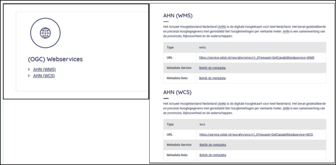
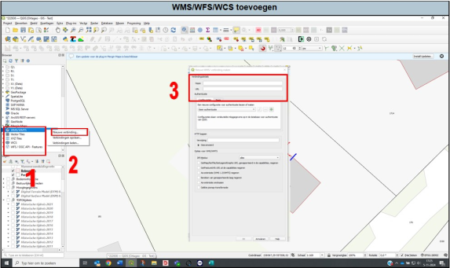

---

title: "3.7 WMS/WFS/WCS"

date: 2025-11-11

draft: false 

weight: 70    

---

Nagenoeg alle externe datalagen in het Qgis-sjabloon van Ortageo (Topotijdreis, AHN, luchtfoto’s, etc.) staan niet lokaal op een schijf van Ortageo. Deze staan bij de desbetreffende eigenaar en zijn middels een WMS (Web Map Service), WFS (Web Feature Service) of WCS (Web Coverage Service). Hiervoor is gekozen, omdat anders het opstarten van het sjabloon nog langer zal duren. Het nadeel is dat als de eigenaren de datalagen updaten of verwijderen, deze niet meer beschikbaar zijn. Indien deze geüpdatet zijn, dan wordt het sjabloon ook zo spoedig mogelijk geüpdatet.

Zelf kan je ook datalagen op deze manier toevoegen. Deze staan dan wel alleen in het sjabloon waar je ze toevoegt. Mochten ze voor de rest van de organisatie relevant zijn, geef het door aan het Qgis-team.

Op websites, bijvoorbeeld PDOK, kan je ze als volgt herkennen:

Om een deze nu aan Qgis toe te voegen, kopieer (ctrl+c) de URL. Ga nu naar Qgis.

1. Ga in de browser naar WMS, WFS of WCS en druk op rechtermuisknop (Figuur 29).
2. Druk op nieuwe verbinding.
3. Er opent een pop-upscherm. Geef de verbinding een naam en plak (ctrl+v) de URL.

Ga in de browser vervolgens naar je verbinding, selecteer de datalaag en sleep deze naar je lagen.

