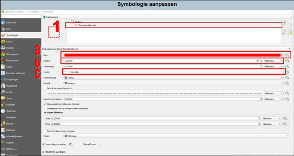

---

title: "4.1 Symbologie – enkel symbool"

date: 2025-11-14

draft: false 

weight: 10

--- 
De stijl en opmaak van je vectorlagen kan je aanpassen onder ‘Symbologie’. Dit doe je als volgt:

1.	Ga naar de eigenschappen van de betreffende laag.
2.	Ga vervolgens naar ‘symbologie’.

De volgende aspecten kan je aanpassen (zie Figuur 4.1):

<ol style="margin-left: 1em;">
<li>Druk op de vulling. Je kan nu het volgende aanpassen:</li>
<ol style="margin-left: 2em; list-style-type: lower-alpha;">
<li>Kleur van de lijn;</li>
<li>De dikte van de lijn;</li>
<li>Type van de lijn.</li>
</ol>
</ol>

  
  Figuur 4.1

