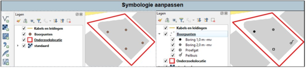
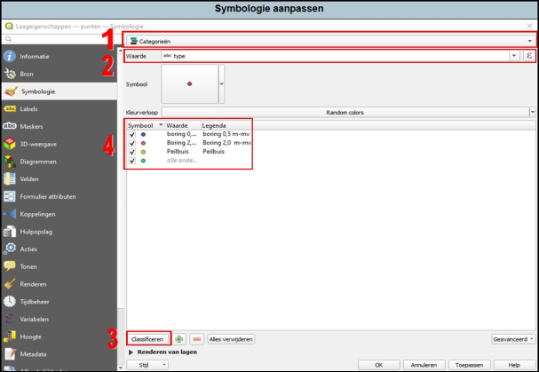

---

title: "4.2 Symbologie – categorieën"

date: 2025-11-17

draft: false   

weight: 20

---

In het onderstaande voorbeeld bevat de laag ‘Boorpunten’ vier boringen. In de linker weergave is gebruik gemaakt van één enkel symbool voor de vier onderzoekspunten. In de rechter weergave is in dezelfde laag gebruik gemaakt van meerdere symbolen (boringen, proefgat, peilbuis). Het gebruik maken van meerdere symbolen kan worden ingesteld onder **categorieën**. 

Figuur 4.2a

Open de eigenschappen en ga naar ‘Symbologie’ door met dubbelklik op de laag ‘Boorpunten’ te klikken. 

1. De bovenste regel aanklikken (1 in Figuur 4.2b). Kies in plaats van ‘Enkel symbool’ de optie ‘Categorieën’.
2. Kies bij ‘Waarde’ de kolom die je wilt categoriseren, in dit geval de aangemaakt kolom ‘type’.
3. Klik op ‘Classificeren’, hierbij worden alle unieke velden in de geselecteerde kolom geclassificeerd.
4. Alle unieke velden worden geclassificeerd en voorzien van een symbool. Deze symbolen kun je naar eigen wens aanpassen, hieronder zijn ze aangepast. Druk op ‘toepassen’ en vervolgens op ‘OK’.

Figuur 4.2b

Wanneer je een uitgebreide attributentabel hebt, kan je ook heel veel categorieën hanteren. Als je bijmengingen in je attributentabel opneemt kan je bijvoorbeeld puin, asbest of kolengruis met eigen symbolen weergeven. 

