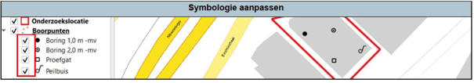
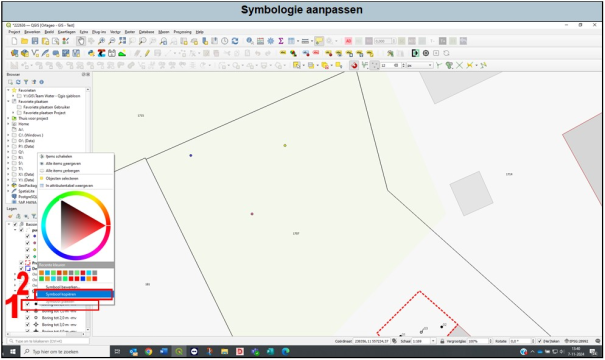
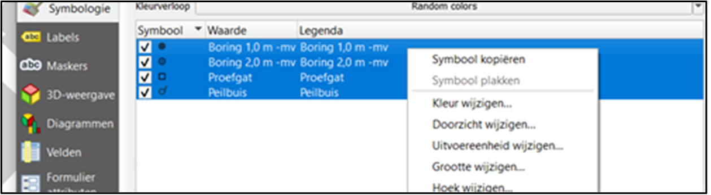
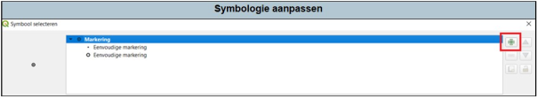
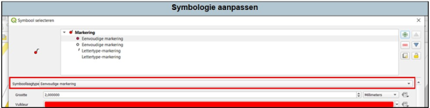
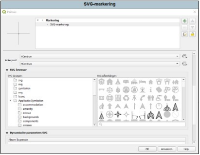

De opmaak van symbolen kan je naar eigen wens aanpassen, dit geldt voor alle typen lagen (polygonen, lijnen, punten).

In het voorbeeld hieronder is voor de onderzoekslocatie één categorie gehanteerd (rode omtrek in Figuur 4.3a). Voor de boorpunten zijn vier categorieën geclassificeerd. In het lagenpaneel (links) is zichtbaar dat je de verschillende categorieën van de boorpunten ook per categorie kan aan- en uitzetten met het vinkje. Je kan bijvoorbeeld, bij projecten met een grote hoeveelheid boorpunten, de ruimtelijke verdeling van de boringen per categorie bekijken door deze afwisselend aan- en uit te zetten.

Figuur 4.3a

Een hele eenvoudige manier is het kopiëren en plakken van reeds bestaande symbolen uit het lagenpaneel (zie Figuur 4.3b).

1. Ga naar de laag waarvan je het symbool van wilt overnemen. Druk op rechtermuisknop.
2. Druk op ‘symbool kopiëren’.
3. Ga naar de laag waar je het symbool wilt veranderen, druk op rechtermuisknop en vervolgens op ‘symbool plakken’.

Figuur 4.3b

De opmaak van de symbolen kan je aanpassen door dubbel te klikken op de laag ‘Boorpunten’ en vervolgens dubbelklik op de categorie die je wil aanpassen, of door direct dubbelklik op het symbool in je lagenpaneel.

Figuur 4.3c

Door met je linker muisknop ingedrukt alle categorieën te selecteren (zie 4.3c), kan je door vervolgens met rechts binnen het blauwe kader te klikken enkele standaard wijzigingen aanbrengen. Vooral het wijzigen van de grootte kan handig zijn. 

In het voorbeeld hieronder (Figuur 4.3d) is de opmaak van de boring tot 2,0 m -mv zichtbaar. Deze bestaat uit twee losse elementen; een cirkel en een punt. Door hierop te klikken kan je de opmaak per element aanpassen. Als je een element wil toevoegen, dan gebruik je het groene plusteken.

Figuur 4.3d

Door op het groene plusteken te klikken wordt een nieuw element toegevoegd. In het voorbeeld hieronder is een cirkel met rode vulling toegevoegd aan de peilbuis. Hierbij zie je ook dat de peilbuis bestaat uit een eenvoudige markering (cirkel) met twee lettertype-markeringen. Door creatief te zijn kan je op deze manier diverse symbolen samenstellen. 

Figuur 4.3e

Bij Symboollaagtype (zie Figuur 4.3e) kan je ook het type van je symbool aanpassen. Het meest gebruikt is de eenvoudige markering en af en toe een lettertype-markering zoals bij het voorbeeld van de peilbuis. Een andere mooie optie is het gebruiken van een **SVG-markering** (Scalable Vector Graphics). Zoals uit de afkorting al blijkt kan je dit beschouwen als een (vector)afbeelding die je op iedere gewenste resolutie kan weergeven zonder dat de kwaliteit verminderd (Scalable).  Binnen QGIS zijn er standaard al een aantal van deze afbeeldingen opgenomen, maar je kan zelf ook SVG-afbeeldingen toevoegen. 

Figuur 4.3f

