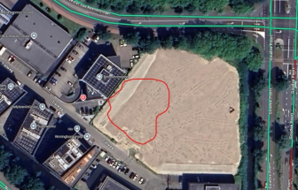
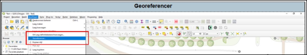
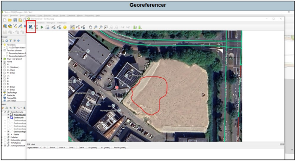
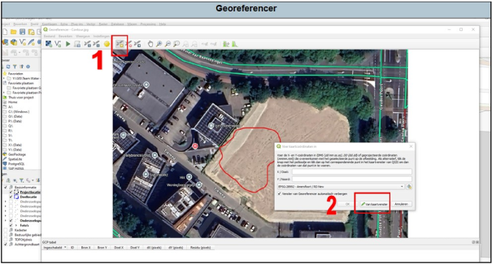
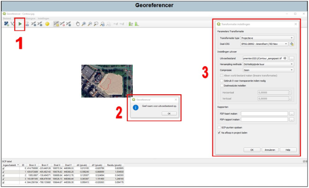
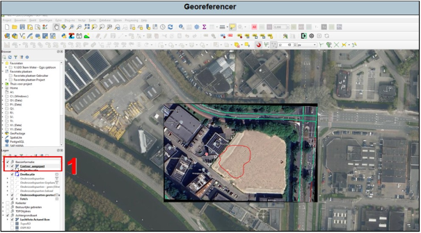

---

title: "5.1 Gebruik"

date: 2025-11-17

draft: false  

weight: 10

---

De **Georeferencer** is bedoeld om afbeeldingen te voorzien van coördinaten zodat ze kunnen worden ingeladen in QGIS. Hierbij is het een vereiste dat de afbeelding herkenbare punten heeft waarvan je de positie of coördinaten kan herleiden. Indien er geen herkenbare punten aanwezig zijn, gebruik dan de Freehand Raster Georeferencer (zie [9.5 Freehand Raster Georeferencer]()).

In de gunstige gevallen kan je door te vergelijken de contouren zelf direct in QGIS tekenen. In sommige gevallen is het echter beter om de complete afbeelding in QGIS te georefereren, en vervolgens de contour over te trekken. In het voorbeeld (Figuur 5.1a) is een contour aangegeven op Google Maps. Deze contour is moeilijk nauwkeurig na te tekenen vanwege de onregelmatige vorm. Deze afbeelding wordt in het volgende voorbeeld in QGIS toegevoegd door te georefereren (Figuur 5.1b).

Figuur 5.1a

De eerste stap is het openen van de Georeferencer:

Figuur 5.1b

Vervolgens opent een nieuw scherm (Figuur 5.1c). Klik hierbij op het symbool links boven en selecteer de afbeelding die je wilt georefereren. Zorg dat je het te georefereren bestand in de map GIS komt te staan. 

Figuur 5.1c

Wanneer je afbeelding is weergegeven zoek je minimaal drie à vier punten, het liefst in een zo groot mogelijk kader binnen de afbeelding, waarvan je de ligging kan herleiden. Indien de afbeelding gedraaid is ten opzichte van het noorden, dan zijn mogelijk meer punten nodig

Je voegt een punt toe met het oranje sterretje (1 in Figuur 5.1d), en vervolgens klik je op een te herleiden punt. Vervolgens komt een schermpje waar je kaartcoördinaten kan invoeren. Het meest makkelijk kan je dit doen door vervolgens op ‘Van kaartvenster’ te klikken (2). Hierna kan je het punt aanklikken in je projectomgeving (in dit geval heb ik een recente luchtfoto geladen, omdat de afbeelding ook een luchtfoto betreft. Dit vergelijkt makkelijk). 

Figuur 5.1d

Herhaal het zoeken van punten minimaal drie à vier keer, je punten worden zichtbaar in de GCP-tabel. Nadat je vier punten hebt gevonden, klik je vervolgens op ‘Geoverwijzingen starten’ (1).

Figuur 5.1e

Je krijgt nu een vraag om de instellingen van de georeferencer in te vullen (2 in Figuur 5.1e), druk op ‘OK’. Pas dit aan, er zijn diverse opties in het instellingen menu (3). 

Gebruik de instellingen zoals in Figuur 5.1e zijn weergegeven. Andere instellingen van o.a. Transformatie type kunnen ook zeker bruikbaar zijn, google eventueel naar alle werkwijzen van de transformatie typen wanneer je hier meer over wilt weten. 

Belangrijk is dat wederom de projectie (Doel CRS) op Amersfoort / RD staat.

Wanneer je afbeelding is gegeorefereerd wordt het een rasterbestand, de locatie en naam kan je alvast bij ‘Uitvoer raster’ aangegeven. De afbeelding wordt als TIF-bestand opgeslagen, hierbij wordt standaard ‘\_aangepast’ toegevoegd aan de originele bestandsnaam.

Klik vervolgens op OK en weer op ‘Geoverwijzingen starten’ (1). De afbeelding wordt in QGIS geladen. Soms geeft de georeferencer nu een foutmelding. In dat geval, sla de GCP-punten en het gehele Qgis-project op. Start nu Qgis opnieuw op. Meestal doet de georeferencer het nu weer.

Figuur 5.1f

Je gegeorefereerde afbeelding verschijnt in het menu als raster en wordt zichtbaar in je hoofdscherm (1 in Figuur 5.1f). Wanneer je wat onzorgvuldig je punten hebt uitgekozen kan er een klein zwart randje rondom de afbeelding ontstaan. Bij een grote zwarte rand of vervorming van de afbeelding heb je waarschijnlijk een fout gemaakt met het aanklikken van de punten die je hebt gebruikt.

Je kan nu de Georeferencer weer sluiten. Hierbij krijg je de vraag of je de GCP-punten wil bewaren. Als je de afbeelding nog eens beter wil georefereren, dan kan je de punten opslaan. Als de afbeelding al voldoende is gegeorefereerd, dan hoef je de punten niet te bewaren. 

