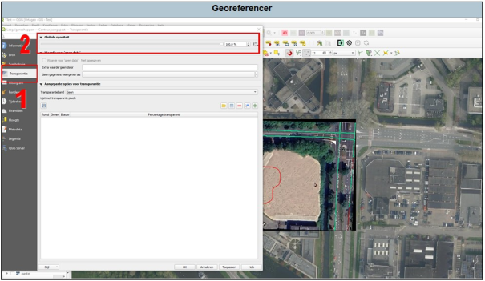

---

title: "5.2 Opmaak"

date: 2025-11-17

draft: false  

weight: 20

---

De opmaak van gegeorefereerde afbeeldingen kan je beperkt wijzigen. Het is met name handig om de transparantie aan te passen wanneer je meerdere lagen over elkaar hebt (zie 1 in Figuur 5.2). 

Als je na het georefereren een klein zwart kader rond de afbeelding hebt kan je dit weghalen door te gaan naar ‘Eigenschappen’ en vervolgens bij ‘Extra waarde ‘geen data’’ (zie Figuur 5.2) een ‘0’ in te voeren (getal). 

Figuur 5.2

