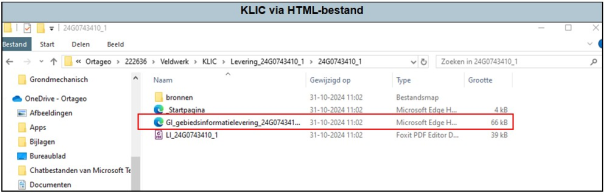
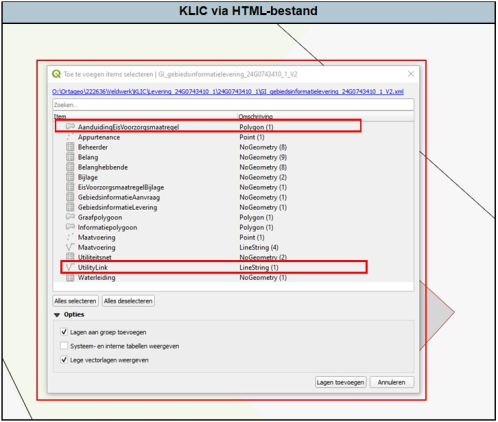
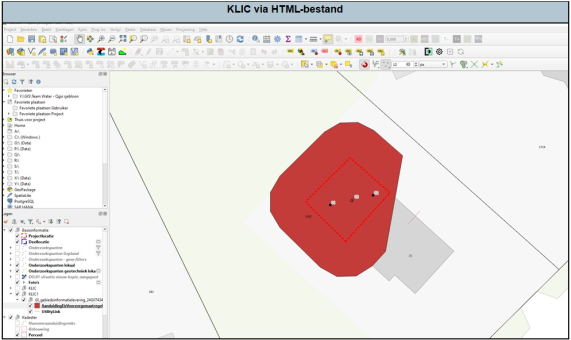

---

title: "6.1 KLIC inladen door HTML-bestand slepen"

date: 2025-11-17

draft: false  

weight: 10

---

Zoek het HTML-bestand op in de verkenner. Deze heeft meestal een naam als “GI\_gebiedsinformatielevering” (zie Figuur 6.1a). Selecteer deze met je linker muisknop en sleep deze naar het QGIS project. 

**Tip:** maak eerst onder de groep ‘basisinformatie’ een nieuwe groep ‘KLIC’ aan (rechtermuisknop en dan ‘groep toevoegen’; zie ook Figuur 6.2a).

Figuur 6.1a

Vervolgens krijg je het volgende scherm te zien (Figuur 6.1b). Nu kan je de lagen selecteren welke je wilt toevoegen. De laag ‘UtilityLink’ is je KLIC-laag. Deze zal altijd moeten selecteren. In onderstaand voorbeeld is ook sprake van een Eis Voorzorgsmaatregel. Deze zal je dan ook moeten selecteren. Voeg beiden toe.

Figuur 6.1b

De KLIC wordt op de volgende manier zichtbaar (Figuur 6.1c). Eventueel kan je nu de symbologie aanpassen (zie ook [4 Symbologie]()). 

**Let op!** Vaak staat de CRS van de laag ‘UtilityLink’ niet goed (zie [3.6 Coördinaten systemen van kaartlagen (CRS)]()). Pas dit aan naar Amersfoort.

Figuur 6.1c

