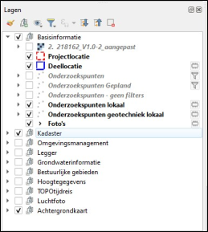
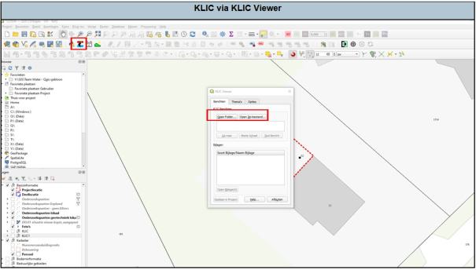
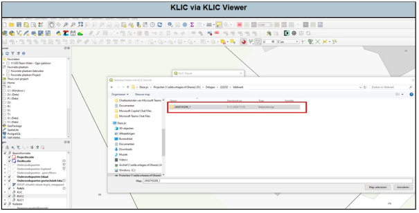
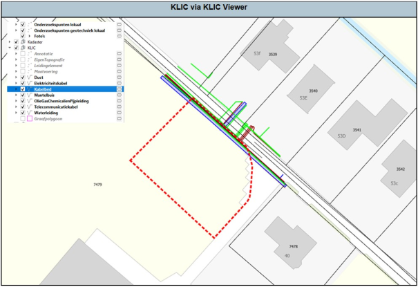
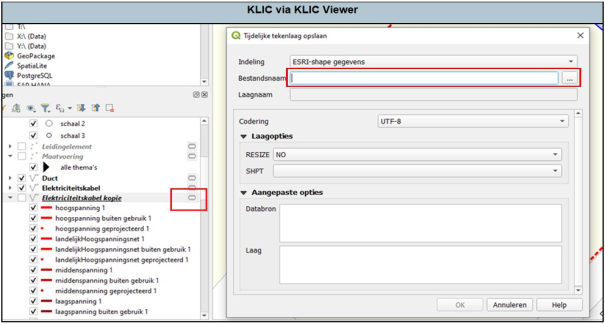

---

title: "6.2 Inladen KLIC met KLIC Viewer"

date: 2025-11-17

draft: false  

weight: 20

---

Bij het inladen van een KLIC is het altijd het handigst om in de lijst met kaartlagen een mapje toe te voegen met “KLIC” zo behoud je het overzicht van je kaartlagen. Dat komt omdat er bij het inladen van de KLIC veel kaartlagen worden ingeladen. Dat doe je als volgt:

Klik op “Groep toevoegen”. Hiermee wordt een groep/map geopend in de lijst met kaartlagen. Deze kan je naar de juiste locatie verslepen in de kaartlagen door met de linker muisknop en deze op de juiste locatie los te laten.

Figuur 6.2a

Vervolgens kan je de groep een andere naam geven door met de rechtermuisknop op de laag te klikken en dan “Groep hernoemen” te selecteren. Dan krijg je de mogelijkheid om de naam te veranderen, dus in dit geval “KLIC”. Als je tevreden bent met de naam die je hebt ingevoerd, kan je op ENTER klikken om akkoord te gaan met de nieuwe naam. Als je toch de naam niet wilt veranderen kan je op ESC drukken. 

Vervolgens kunnen we de KLIC Viewer openen via de werkbalk. Klik met de linkermuisknop op de KLIC Viewer om deze te openen. Vervolgens wordt er een nieuw scherm geopend.

Afhankelijk van hoe de KLIC is opgeslagen kan je de KLIC openen via de “Open Folder” of “Open Zip-bestand” knoppen. Over het algemeen wordt binnen Ortageo de Zip-map nadat deze binnen is gekomen uitgepakt en moet je daarom op “Open folder” klikken. Er wordt een nieuw venster geopend.

Figuur 6.2b

In het nieuwe venster ga je op zoek naar de folder waar het KLIC-bestand staat opgeslagen. Over het algemeen staat die opgeslagen in jouw project folder onder “KLIC” en heeft bijvoorbeeld een naam zoals hieronder aangegeven (Figuur 6.2c). Als je de map hebt aangeklikt met je linkermuisknop, druk dan op “map selecteren” rechts onderin. Het venster wordt dan weer gesloten en je krijgt het vorige venster weer te zien. Als alle lagen van de KLIC zijn ingeladen, klik dan op “afsluiten”.

Figuur 6.2c

Zet vervolgens alle gewenste kaartlagen aan in het kaartlagen venster. De kaart ziet er vervolgens ongeveer zo uit Figuur 6.2d).

Figuur 6.2d

Alle geladen lagen van de KLIC-melding betreffen tijdelijke tekenlagen. Deze tijdelijke lagen zal je nu dus één voor één permanent moeten maken. Dit doe je door op de knop aan de rechterkant van de laag te klikken met je linkermuisknop. Selecteer vervolgens de juiste locatie om hem op te slaan en sla hem op.

Figuur 6.2e

