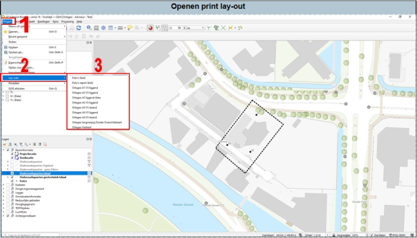
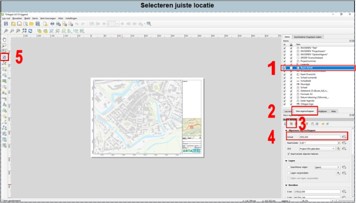
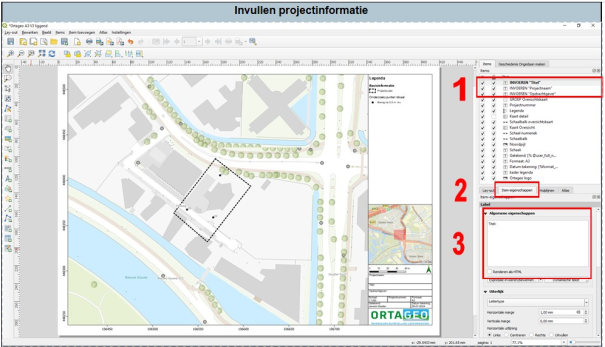
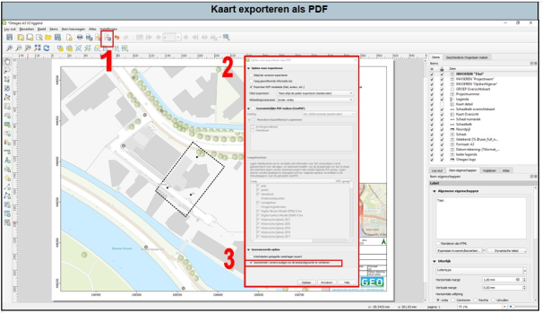
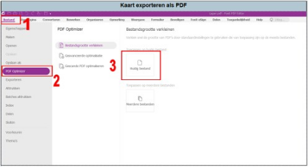

---

title: "7.2 Print lay-out maken"

date: 2025-11-17

draft: false 

weight: 20      

---

Het opstellen van een boorplan of situatietekening gaat als volgt:

1. Klik op het dropdownmenu ‘project’ (1 in Figuur 7.2). 
2. Klik vervolgens op ‘lay-outs’. 
3. Kies het gewenste formaat van de lay-out. 

Figuur 7.2a

Het volgende scherm wordt zichtbaar (Figuur 7.2b). Deze zal tijdens de eerste keer van het openen van de Lay-out niet op je onderzoekslocatie staan. Om naar je locatie te gaan en ook om de schaal aan te passen, zal je het volgende moeten doen:

1. Als eerste selecteer je de ‘detailkaart’. 
2. Klik vervolgens op ‘item-eigenschappen’. 
3. Door op dit icoontje te klikken, verplaatst de detailkaart direct naar jouw projectlocatie. 
4. Pas de schaal aan naar de gewenste schaal. Let op, indien de schaalbalk er niet uitziet, druk op het ‘refresh’-icoontje (eventueel 2x). 
5. Met dit icoon kan je het beeld in de detailkaart verschuiven. 

Figuur 7.2b

Vervolgens kan je kaart-specifieke informatie gaan invullen (Figuur 7.2c):

1. Klik in het vak ‘items’ op ‘titel’; 
2. Klik op ‘item-eigenschappen’; 
3. Hier kan je de titel van de tekening invullen. 
4. Doe dit ook voor ‘projectnaam’ en ‘opdrachtgever bij ‘1’. 

Figuur 7.2c

Nu kan je je boorplan of situatietekening exporteren (Figuur 7.2d):

1. Klik in de taakbalk op het bovenstaande icoontje. Er opent nu een scherm waarin je de bestandslocatie en -naam moet opgeven.
2. Nadat je de bestandslocatie en -naam hebt opgegeven opent dit scherm zich.
3. Helemaal onderaan staat de optie ‘geometrieën vereenvoudigen om bestandsgrootte te verkleinen’, **zet dit vinkje altijd uit**.
4. Klik nu op de knop ‘opslaan’. Je PDF wordt nu opgeslagen.

Figuur 7.2d

**Tip:** indien je een tekening met een luchtfoto als achtergrond exporteert, dan krijg je waarschijnlijk een bestand van meerdere tientallen MB’s. Dit kan je verhelpen door in Foxit naar ‘bestand’ te gaan (1), vervolgens naar ‘PDF Optimizer (2) en dan ‘huidig bestand’ (3). Je tekening zal nu een stuk kleiner zijn qua bestandsgrootte.

Figuur 7.2e

