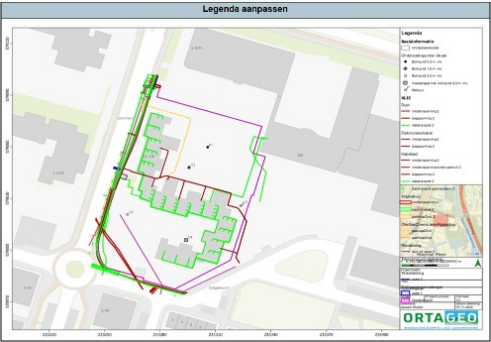
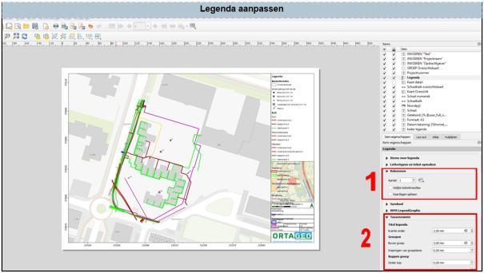
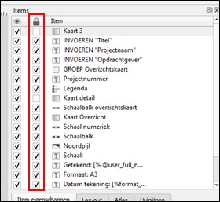
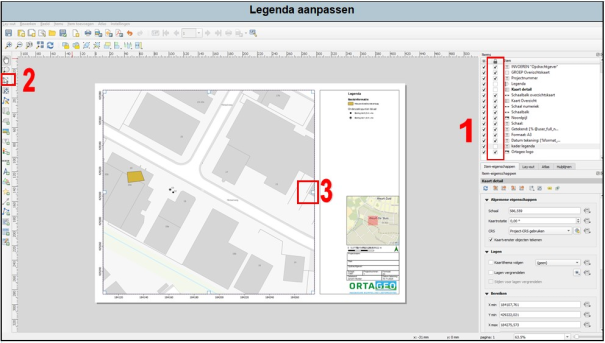

---

title: "7.3 Aanpassen legenda"

date: 2025-11-17

draft: false 

weight: 30      

---

Het kan voorkomen dat je legenda vanwege de vele onderdelen niet goed eruit ziet. Bijvoorbeeld zo:

Figuur 7.3a

Je kan de legenda op een aantal manieren aanpassen:

1. Je kan het aantal kolommen in de legenda aanpassen (1 in Figuur 7.3b). 

2. Je kan de ruimte tussen de regels en symbolen aanpassen.

3. Aanpassen van de grootte van de vensters (zie Figuur 7.3d).

Figuur 7.3b

Indien bij de legenda-items het slotje is aangevinkt, dan is het niet mogelijk om dit item aan te passen. Om de grootte van de vensters aan te passen, zet het vinkje bij ‘kader legenda’ uit. Eventueel kan je dit bij andere legenda-items ook doen.

Figuur 7.3c

Pas vervolgens de afmetingen van in ieder geval de detailtekening en de legenda aan (3 in Figuur 7.3d). Om de afmetingen aan te passen, zal je eerst op het icoontje zoals staat bij nr. 2 in figuur 7.3d moeten drukken.

Figuur 7.3d

