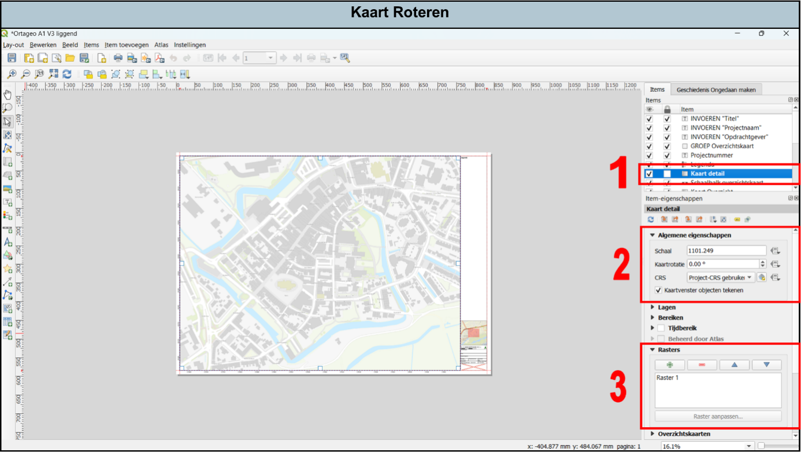
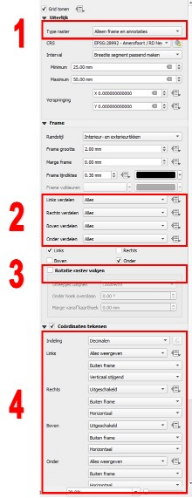

---

title: "7.4 Kaart Roteren"

date: 2025-11-17

draft: false 

weight: 40      

---

Het is mogelijk om de kaart te roteren voor een betere weergave van de situatie. De assen roteren mee, waardoor soms Y-waarden op de X-as verschijnen en andersom, hierbij kan het wenselijk zijn om de assen verder op te maken. Volg hiervoor de volgende stappen: 

1. Selecteer het item ‘kaart detail’ (Figuur 7.4a).
2. Ga naar ‘algemene eigenschappen’, hier is het mogelijk om de rotatie van de kaart in te voeren in een bereik van 0 tot 360 graden. De noordpijl roteert automatisch mee.
3. Voor de opmaak van de assen ga naar het kopje ‘rasters’. Klik op het raster (in de meeste gevallen ‘Raster 1’) en klik op raster aanpassen.

Figuur 7.4a

Er zijn verschillende opties om de assen aan te passen (zie Figuur 7.4b). Hieronder een overzicht met de belangrijkste opties. 

1. Onder het kopje ‘uiterlijk’ is het mogelijk het type raster aan te passen. Door hierbij ‘doorgetrokken’ te selecteren komt het gehele raster in beeld. Dit kan verduidelijken dat het om een geroteerde kaart gaat en laat ook gelijk zien waarom de assen opmaak veranderd. Wil je geen raster, kies dan weer voor ‘alleen frame en annotaties’. 
2. Onder het kopje ‘frame’ is het mogelijk de annotaties aan te passen. Wil je geen X-annotaties op de Y-as of andersom, kies dan bij ‘links verdelen’ en ‘onder verdelen’ voor alleen X of Y i.p.v. alles. Hetzelfde kan gedaan worden voor de coördinaten (zie 4). 
3. Het is ook mogelijk om de annotaties mee te laten roteren, wat ook kan verduidelijken dat de kaart geroteerd is. Kies hiervoor ‘Rotatie raster volgen’.
4. Onder het kopje ‘Coördinaten tekenen’ is het op dezelfde wijze als bij (3) mogelijk om ook in te stellen dat de X as enkel X coördinaten vertoont en andersom. 

Figuur 7.4b

