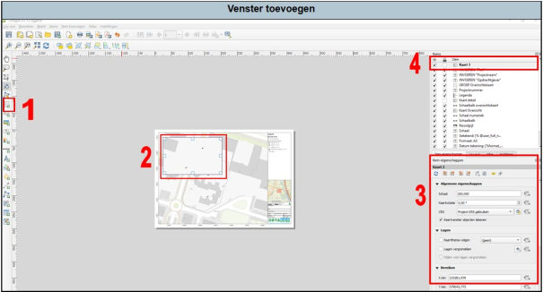

---

title: "7.5 Vensters toevoegen"

date: 2025-11-17

draft: false

weight: 50

---

Indien je een extra venster wilt toevoegen aan je situatietekening, bijvoorbeeld als je wilt inzoomen op een verontreinigingssituatie, dan is dit relatief eenvoudig te doen.

1. Druk op dit icoontje (1 in Figuur 7.5). Klik ongeveer waar je het extra venster wilt hebben. Nu komt er een pop-upscherm, druk op ‘OK’. 
2. Pas de afmetingen van het venster naar wens aan. 
3. Pas de eigenschappen (zoals de schaal) van het venster aan.
4. Het nieuwe venster is nu ook weergegeven bij de legenda-items.

Figuur 7.5

