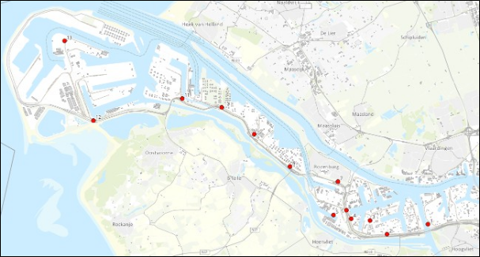
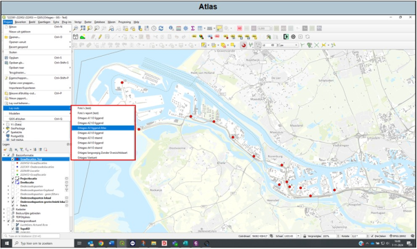
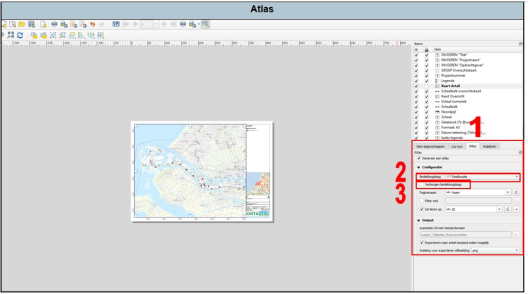
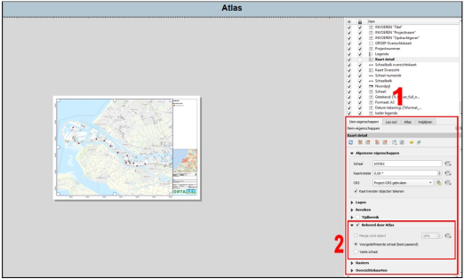
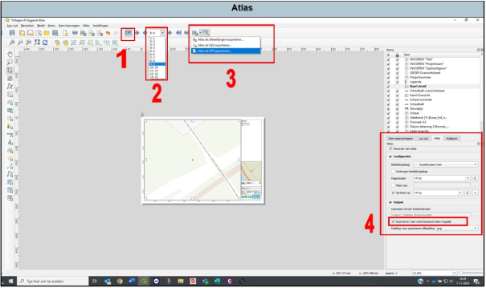

---

title: "7.6 Atlas"

date: 2025-11-17

draft: false

weight: 60

---

Als je onderzoekslocatie een tracé van meerdere kilometers betreft of je onderzoekslocatie meerdere aparte deellocaties betreft, dan kan het veel tijd kosten om meerdere boorplannen of situatietekeningen uit te draaien. Hiervoor heeft Qgis de ‘Atlas’-functie. Hiervoor zal je zelf de afweging moeten maken wat sneller is: één voor één boorplannen maken of de atlas gebruiken.

Figuur 7.6a

Voor de atlas is reeds al een aparte lay-out aangemaakt (zie Figuur 7.6b). Open deze.

Figuur 7.6b

De eerste paar stappen van het maken van de atlas zullen hetzelfde zijn als bij het opstellen van een enkele boorplan of situatietekening (invullen projectgegevens e.d.).

Zodra je de projectgegevens het ingevuld:

1. Ga naar Atlas (**let op:** selecteer eerst het item ‘kaart detail’; zie Figuur 7.6c);
2. Kies je bedekkingslaag. Op basis van deze laag maakt de atlas het aantal tekeningen.
3. Indien nodig, kan je van deze bedekkingslaag een verborgen bedekkingslaag maken. De punten of vlakken waarop de atlas het aantal tekeningen baseert zal dan niet zichtbaar zijn.

Figuur 7.6c

Ga vervolgens terug naar ‘item-eigenschappen’ (1 in Figuur 7.6d) en dan naar het kopje ‘beheerd door atlas’ (2). Hier kan je instellen of de atlas zelf een schaal bepaald of dat jij zelf een schaal kiest.

Figuur 7.6d

Vervolgens kan je de atlas laten aanmaken.

1. Druk op dit icoontje (1 in Figuur 7.6e). De atlas wordt nu aangemaakt.
2. Hier kan je door de verschillende tekeningen gaan. Controleer of alles erop staat.
3. Indien alles klopt, dan kan je de tekeningen exporteren.
4. Let op dat je dit vinkje aan hebt staan.

Alle tekeningen worden nu als één PDF aangemaakt.

Figuur 7.6e

Voor een tracé werkt dit precies hetzelfde. Echter zal je wel zelf eerst een bedekkingslaag moeten aanmaken met punten op een bepaalde afstand van elkaar. Hiervoor kan je het beste de functie ‘punten langs geometrie’ gebruiken (zie 10.1 Punten langs geometrie).

Doordat je bij tracés zelf de afstanden moet bepalen van de bedekkingslaag, zal je de ideale schaal ook zelf moeten bepalen. Dit vergt enige iteratie.

