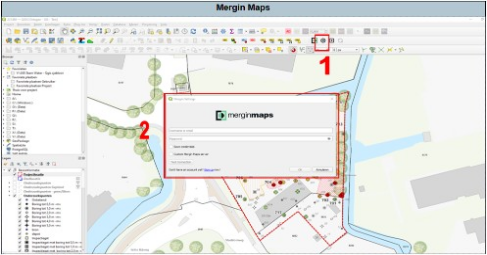
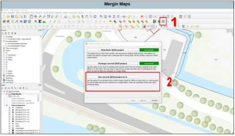
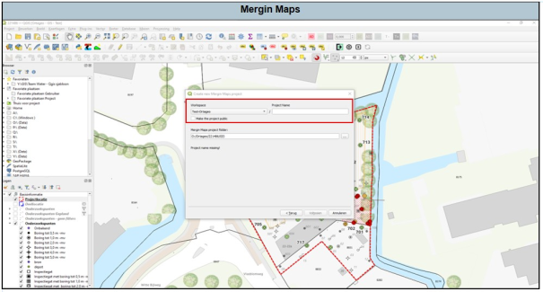
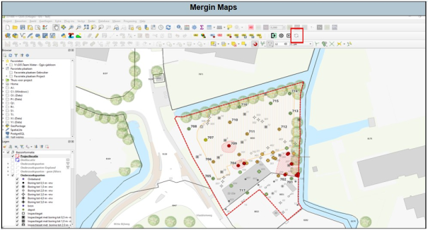

---

title: "8 MERGIN MAPS"

date: 2025-11-18

draft: false

weight: 80

---

Mergin Maps is de nieuwe veldwerk-app. Hiervan is in Qgis een plug-in beschikbaar. Indien deze niet zichtbaar is, voeg deze toe: zie [9 PLUG-Ins]() .

Via Mergin Maps krijgen de veldwerkers de datalagen welke jij in Qgis ziet ook te zien. Hierdoor zal je na moeten gaan welke datalagen relevant zijn. Probeer zo veel mogelijk niet-relevante datalagen te verwijderen. Hierdoor laadt het project in Mergin Maps sneller en start Qgis ook sneller (minder langzaam) op.

Indien je nog geen account hebt van Mergin Maps, ga eerst naar [merginmaps.com](https://merginmaps.com/) en maak een account aan. Neem vervolgens contact op met Team Qgis. Zij zullen je een uitnodiging sturen voor de workspace van Ortageo. (**Tip:** installeer de app van Mergin Maps op je telefoon, dan kan je altijd checken of het project goed is upgeload).

Zodra het project gereed is voor uitvoering en alle noodzakelijke gegevens (boorpunten, KLIC, etc.) klaar zijn, druk je op het volgende icoontje (1) in Figuur 8a. Er verschijnt een pop-upscherm (2). Log nu in.

Figuur 8a

Druk vervolgens op het volgende icoontje (1) in Figuur 8b. Nu ga je het project naar Mergin Maps synchroniseren. Er verschijnt een pop-upscherm. Kies altijd het volgende knopje.

Figuur 8b

**Let op:** Indien deze knop niet beschikbaar is, dan staat in de map ‘GIS’ van de projectmap al een project wat is gesynchroniseerd met Mergin Maps.

Het volgende scherm verschijnt (Figuur 8c). Kies hier de workspace van Ortageo en voer je projectnummer (evt. met plaatsnaam) in. **Let op:** vink **nooit** het knopje ‘make the project public’ aan!

Figuur 8c

Het project wordt nu gesynchroniseerd met Mergin Maps. Check altijd of dit juist is gebeurd.

Indien je na het uploaden nog iets wilt wijzigen, dan kan dit. Hiervoor zal je na de wijzigingen op het onderstaande knopje moeten drukken in Figuur 8d.

Figuur 8d

Met het werken via Mergin Maps zal je in ieder geval op de volgende dingen moeten letten:

* Werken via de C-schijf: Ook hier geldt, als je het Qgis-project lokaal hebt opgeslagen, dan kan een collega er niet bij. Let hier bij op tijdens overdracht van projecten en tijdens het opslaan.
* Als je in de map ‘GIS’ 2 of meer Qgis-projecten hebt staan, dan lukt het uploaden niet. Wees hier bewust van.

