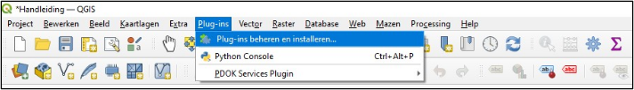
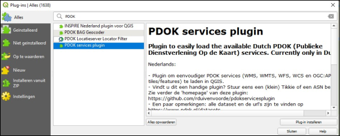
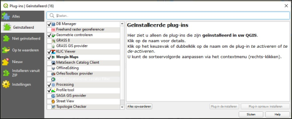

Zoals eerder benoemd kan je een plug-in beschouwen als een niet-standaard uitbreiding binnen QGIS. Plug-ins kan je in QGIS toevoegen via het onderstaand menu (Figuur 9.1a). 

Figuur 9.1a

In het pop-up menu klik je op het knopje ‘alles’ (Figuur 9.1b) om toegang te krijgen bij alle bekende plug-ins van QGIS. Vervolgens kan je in de bovenste balk de plug-in zoeken die jij nodig hebt. Selecteer dan in de lijst van plug-ins de plug-in die jij wilt installeren en klik vervolgens op het blokje ‘Plug-in installeren’.

Figuur 9.1b

Om er zeker van te zijn dat je jouw geïnstalleerde plug-ins kan gebruiken, klik je vervolgens op ‘Geïnstalleerd’ (Figuur 9.1c). Zorg ervoor dat het vinkje voor je plug-in is aangevinkt als je deze wilt gebruiken.

Figuur 9.1c

Een aantal plug-ins is zeer bruikbaar voor gebruik bij onder andere verkennend bodemonderzoek. Relevante plug-ins en de werking hiervan wordt hieronder per plug-in behandeld. De plug-in ‘Mergin Maps’ is in het voorgaande hoofdstuk behandeld (8 Mergin Maps).