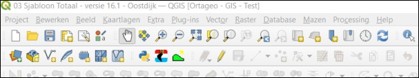
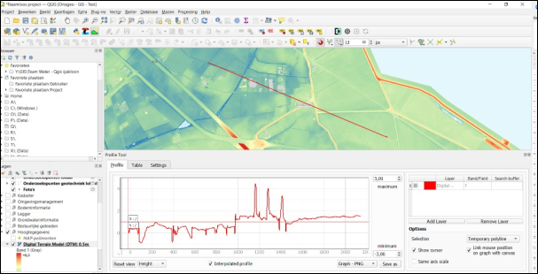

Met de Terrain Profile kan je een grafiek maken van de verschillen in waarden van een raster. Het is bijvoorbeeld heel handig om een grafiek te maken van de hoogteverschillen van een onderzoekslocatie. De Terrain Profile kan je op de taakbalk vinden (zie Figuur 9.2a).

Figuur 9.2a

Als je op de plug-in klikt wordt er een nieuw venster geopend aan de onderkant van het scherm. Als je gebruik wilt maken van de plug-in, moet je ervoor zorgen dat je de laag waarvan je een profiel wilt maken (bijvoorbeeld AHN) hebt geselecteerd in de lijst met lagen (zie Figuur 9.2b). Vervolgens klik je op de knop ‘Add layer’. Als je dan een lijn tekent op de kaart, dan creëert de tool een grafiek met de verschillen in waarden.

Figuur 9.2b

