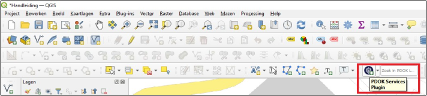

Deze plug-in geeft toegang tot diverse **algemene kaarten** waarvan er meerdere heel bruikbaar zijn, waar¬onder luchtfoto’s, topografische kaarten, gemeentegrenzen etc. Een deel van deze kaarten staat reeds in het sjabloon. 

Wanneer deze plug-in is geïnstalleerd verschijnt deze in je menu met werkbalken, waarbij ook een zoekveld verschijnt waarbij je op topografische locaties kan zoeken (zie Figuur 9.3). Kaarten toevoegen doe je door met links op het blauwe symbool te klikken. Vervolgens verschijnt een menu met beschikbare lagen waaruit je kan kiezen door erop te klikken. Gewenste lagen kan je zoeken door een zoekopdracht in te voeren of door te scrollen door het menu. 

Figuur 9.3

