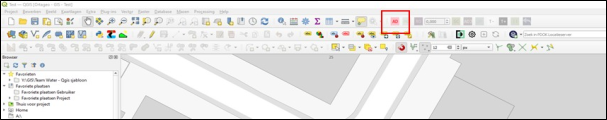
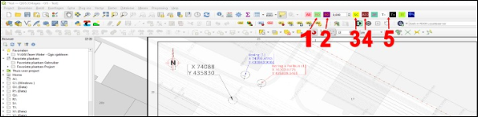

Indien geen herkenbare punten beschikbaar zijn om de Georeferencer (zie ook [5 Georeferencer]()) te gebruiken, dan kan je de plug-in ‘Freehand Raster Georeferencer’ gebruiken.

Figuur 9.5a

Om een bestand te georefereren, klik op het icoontje (zie Figuur 9.5a). Er wordt nu gevraagd om het desbetreffende bestand up te loaden. Zoek het bestand op en druk op OK en vervolgens op ‘add new’. Het bestand is nu toegevoegd aan de datalagen. Vink deze nu aan.

Figuur 9.5b

Je kan het bestand middels de volgende knoppen georefereren (zie Figuur 9.5b):

1. Move: hiermee verplaats je het bestand;
2. Rotate: hiermee draai je het bestand;
3. Scale: hiermee kan je het bestand groter of kleiner maken;
4. Adjust: hiermee kan je het bestand aan één zijde groter of kleiner maken;
5. Transparantie: hiermee verhoog of verlaag je de transparantie van het bestand.

Deze manier van georefereren is iets meer zelf uitvogelen en vraagt enige iteratie.
