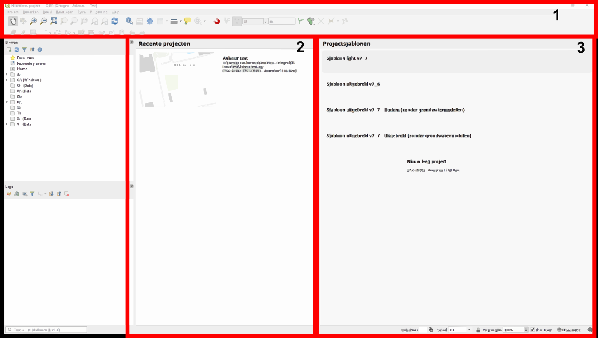

Bij het opstarten van QGIS krijg je als eerste het opstartscherm van QGIS te zien, zie ook Figuur 1.3. In het opstartscherm zijn al een aantal delen van elkaar te onderscheiden.

1. **Menubalk**: Hier zitten in alle instellingen en functies, waaronder ook het opslaan van een bestand;

2. **Recente projecten**: Dit is een overzicht van alle recente geopende projecten;

3. **Projectsjablonen**: Dit is een overzicht van alle beschikbare sjablonen, wordt door de QGIS-beheerder regelmatig bijgewerkt.

  
  Figuur 1.3

